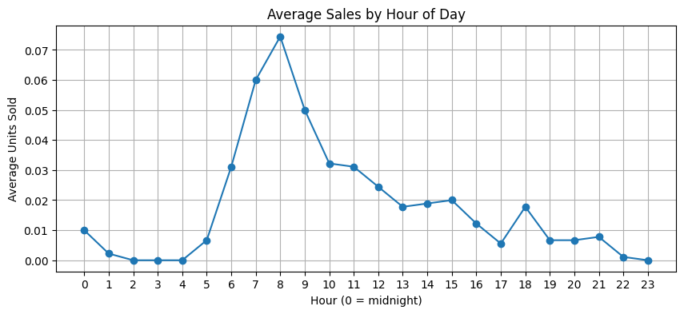
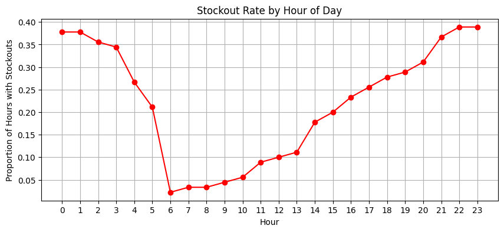
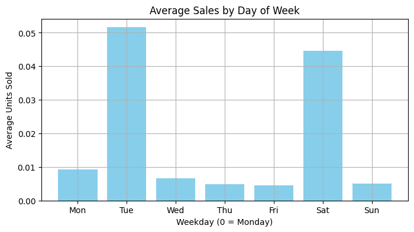
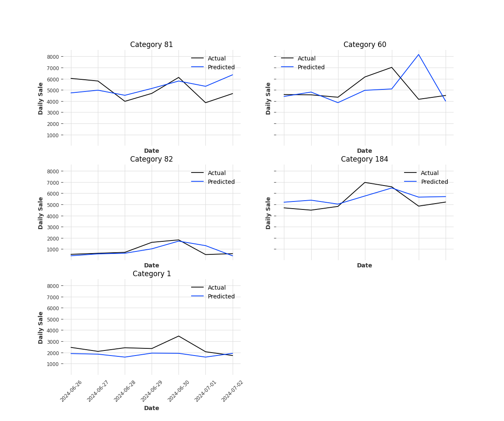

# 🛒 Stockout-Aware Product Demand Forecasting using FreshRetailNet‑50K

This project aims to forecast product demand in retail stores while accounting for real-world complexities such as stockouts, promotions, holidays, and weather effects. It uses the [FreshRetailNet-50K](https://huggingface.co/datasets/Dingdong-Inc/FreshRetailNet-50K) dataset — a large-scale, real-world perishable goods sales dataset from 898 stores across 18 cities.

---

## 🌟 Problem Statement

> **How can we accurately forecast product demand in retail stores while accounting for stockouts, promotions, and contextual factors like weather and holidays?**

This project focuses on building a forecasting system that:

* Recovers **true latent demand** during stockout periods
* Models **temporal and contextual patterns** driving demand
* Supports inventory planning and loss prevention strategies

---

## 🧠 Dataset Summary

* **Source**: [FreshRetailNet-50K](https://huggingface.co/datasets/Dingdong-Inc/FreshRetailNet-50K)
* **Granularity**: Hourly sales for 863 perishable SKUs
* **Stores**: 898
* **Time Window**: 90 days
* **Key Columns**:

  * `hours_sale`: Units sold per hour
  * `hours_stock_status`: 1 = stockout, 0 = in-stock
  * `discount`, `activity_flag`: Promotion metadata
  * `holiday_flag`, `precpt`, `avg_temperature`: Contextual features

---


## 🧭 Industry Inspiration: How Major Retailers Forecast Demand

This project draws inspiration from how retail giants like Walmart, Target, and The Home Depot tackle forecasting at scale. Here’s a curated overview of their strategies:

---

🔹 **1. AI-Powered Demand Forecasting & Stockout Prevention**
- **Walmart** uses AI to tailor inventory based on regional trends and prevent stockouts by reallocating inventory across geographies ([Walmart AI Blog](https://corporate.walmart.com/newsroom/2021/07/27/how-walmart-is-using-ai-to-make-in-store-shopping-better)).
- **Target** built a real-time “Inventory Ledger” that uses AI to double stock coverage by factoring in real-time demand and logistics ([Target AI Ledger – CNBC](https://www.cnbc.com/2021/05/18/how-target-uses-ai-to-track-and-forecast-store-inventory.html)).

---

🔹 **2. Multi-Level Hierarchical Forecasting**
- Walmart Sam’s Club uses machine learning to forecast demand at the item, store, and day level, maintaining coherence across hierarchies ([Walmart Labs Forecasting](https://medium.com/walmartglobaltech/time-series-forecasting-at-scale-at-sams-club-cb13b0ce0b92)).

---

🔹 **3. Real-Time Data Integration & Supplier Collaboration**
- **RetailLink** gives Walmart suppliers real-time access to sales and inventory levels to align restocking ([RetailLink Overview](https://retaillink.wal-mart.com)).
- Walmart pioneered **Vendor Managed Inventory (VMI)** and **Collaborative Planning, Forecasting and Replenishment (CPFR)** in the 1990s ([Walmart VMI Strategy – Harvard](https://hbr.org/2004/11/the-power-of-collaboration)).

---

🔹 **4. Weather-Aware & Event-Based Forecasting**
- Retailers like Walmart and Home Depot integrate **weather APIs** to adjust inventory for expected local surges ([IBM/The Weather Company – Retail Use Case](https://www.ibm.com/blogs/industries/ai-retail-weather-forecasting/)).

---

🔹 **5. Product & Store Segmentation for Scalability**
- Product/store clustering enables better generalization and reduces model count ([Uber’s Time Series Segmentation Approach](https://eng.uber.com/ts-segmentation/)).
- Grouping by **category**, **region**, and **temporal behavior** helps scale forecasting systems.

---

🔹 **6. Cloud-Native Pipelines for Scalability**
- Retailers use **Airflow**, **SageMaker**, and internal MLOps tools to manage training, inference, and deployment ([Walmart’s MLOps Strategy](https://medium.com/walmartglobaltech/mlops-machine-learning-operations-64b4832b17f6)).

---

### ✅ Implications for This Project
- Use **granular features** (store, category, weather) in a global model.
- Apply **hierarchical forecasting** to enforce coherence across product/store levels.
- Prioritize **category-level modeling** to avoid modeling all 50k SKUs individually.
- Integrate **weather/holiday signals** to reflect contextual shifts.
- Plan for **automated retraining workflows** with tools like **Airflow** or **Prefect**.


## 📊 Exploratory Data Analysis (EDA)

### ✔️ Hourly Trends

* Peak demand between **6 AM to 9 AM**
* Stock replenishment typically occurs early in the day

### ✔️ Weekday Behavior

* Highest sales on **Tuesdays** and **Saturdays**
* Minimal activity mid-week

### ✔️ Stockout Analysis

* High stockout frequency overnight and late evening
* Low stockouts in early morning (restock hours)

### ✔️ Promotions & Discounts

* Discounts do not show clear uplift in current subset
* Needs further segmentation or larger-scale comparison

---

## 📈 Sample Visualizations

<p float="left">
  
    
    
  
</p>
<!-- <p float="left"> -->
    <!--  -->
  <!--  -->
<!-- </p> -->


---

## 🧩 Next Steps

* [x] **Latent Demand Recovery**: Estimate true demand during stockouts
* [x] **Daily Aggregation**: Switched from hourly to daily granularity to reduce data sparsity, improve model training stability, and accommodate memory constraints during preprocessing.
* [x] **Train forecasting models** (LightGBM, XGBoost, CatBoost, Random Forest, Extra Trees, GBR)
* [x] **Baseline feature engineering & data processing** for selected third_category_ids (covering ~90 % of demand)  
* [x] **Begin model training**: LightGBM per category on daily‐aggregated & imputed data  
* [x] **Evaluate baseline performance** (RMSE/MAE) & feature importances  
* [x] **Explore recursive vs. direct forecasting strategies**
* [x] **Prototype and compare tabular forecasting models**
* [ ] Containerize pipeline & deploy inference API
* [ ] Set up monitoring for data-drift and model health  

---

## 📂 Project Structure

```
.
.
├── notebooks/
│   ├── 01_eda.ipynb
│   ├── 01_eda_eval.ipynb
│   ├── 02_category_store_analysis.ipynb
│   ├── 03_latent_demand_forecasting.ipynb
│   ├── 04_product_level_demand_imputation.ipynb
│   ├── 05_daily_baseline_modeling.ipynb
│   ├── 06_model_training_analysis.ipynb
│   ├── 07_imputation_and_aggregation.ipynb
│   ├── 08_feature_engineering.ipynb
│   ├── 08_model_recursive.ipynb
│   ├── 09_direct_sliding_window.ipynb
│   ├── 10_sequence_modeling.ipynb
│   └── 11_Sequence_Modelling_GPU.ipynb
├── data/
│   ├── daily_dataset
│   ├── freshretail_flattened_chunks/   # Full hourly data split into parquet chunks
│   ├── flattened_chunks/   
├── src/
│   ├── ingest_flatten.py
│   ├── aggregate_impute.py
│   ├── featurize.py
│   ├── train_pipeline.py
│   ├── prediction_pipeline.py
│   └── backup_prediction_pipeline.py
├── models/
│   ├── lgbm/
│   ├── rf/
│   ├── extra_trees/
│   ├── gbr/
│   ├── xgb/
│   └── catboost/
├── docs/
│   ├── hourly_sales.png
│   ├── stockout_rate.png
│   └── weekday_sales.png
│   └── PredictionPlot_Eval.png
├── README.md
└── requirements.txt
```

---

## 🔧 src/ Scripts Overview

Here is what each script in the `src/` folder does:

- **ingest_flatten.py**: Streams FreshRetailNet hourly data, flattens it into parquet chunks.
- **aggregate_impute.py**: Aggregates the flattened hourly chunks to daily frequency and imputes missing sales and out-of-stock flags.
- **featurize.py**: Builds model-ready feature tables (lags, rolling stats, calendar encodings) for each category.
- **train_pipeline.py**: Runs the end-to-end workflow from ingestion to benchmark-ready model outputs.
- **train_pipeline.py**: Orchestrates the full training pipeline: ingest → aggregate/impute → featurize → train.
- **prediction_pipeline.py**: Prepares eval features if needed, loads trained N‑BEATS models, forecasts from the last 28 days, and plots actual vs. predicted values.

<p float="centre">
  
</p>


---

## 📌 Dependencies

```bash
pip install -r requirements.txt
```
## 🚀 Implementation

**Training**:

```bash
python src/train_pipeline.py \
  --split train \
  --batch-size 12000 \
  --flat-dir data/flattened_chunks \
  --daily-path data/daily_dataset/daily_df_imputed.parquet \
  --modelready-path data/daily_dataset/daily_df_modelready.parquet \
  --cats 81 60 82 184 1 \
  --model-dir models \
  --run-benchmark \
  --benchmark-models lgbm rf extra_trees gbr xgb catboost \
  --benchmark-test-days 10 \
  --input-len 28 \
  --output-len 7
```

**Baseline Model Benchmark Only**:

```bash
python src/train_baseline_benchmarks.py \
  --modelready-path data/daily_dataset/daily_df_modelready.parquet \
  --cats 81 60 82 184 1 \
  --models lgbm rf extra_trees gbr xgb catboost \
  --test-days 10 \
  --output-dir models
```

This writes:
- `models/baseline_benchmark_detailed.csv`
- `models/baseline_benchmark_summary.csv`

The summary file ranks models by mean RMSE across selected categories.

**Prediction**:

```bash
python src/prediction_pipeline.py \
  --train-modelready-path data/daily_dataset/daily_df_modelready.parquet \
  --flat-dir data/flattened_chunks_eval \                
  --daily-path data/daily_dataset/daily_df_eval.parquet \             
  --modelready-path data/daily_dataset/daily_df_eval_modelready.parquet \
  --cats 81 60 82 184 1 \
  --model-dir models \
  --input-len 28 \
  --output-len 7
```

## 🚀 Docker Commands

**Container Setup**:
```
docker compose build
```

**Training**:

```bash
docker compose run --rm trainer
```

**Prediction**:

```bash
docker compose run --rm predictor
```

**Notes**:
- Keep Docker Desktop running before executing commands.
- First run can take time because Python packages and model dependencies are large.
- Training/prediction outputs are persisted to your local workspace because `./` is bind-mounted to `/app`.
---


## ⚠️ Modeling Decisions

* Initially attempted modeling at hourly level (24 values/day) but encountered instability due to memory issues and extreme sparsity during late hours.
* Switched to **daily aggregation** to simplify the pipeline and ensure better generalization across categories and stores.
* Flagged full-day stockout days and anomalous sales during stockouts instead of dropping them — preserving integrity of training samples.
* Initially tested aggregation over **6 AM to 10 PM**, but reverted to **full-day (24 hours)** to maintain consistency and reduce leakage from selective hour exclusions.

_📝 Note: These trade-offs are logged for future benchmarking and ablation studies._

## 🙌 Credits

* Dataset by [Dingdong-Inc](https://huggingface.co/datasets/Dingdong-Inc/FreshRetailNet-50K)
* Inspired by operational research in retail demand planning


